# Librerías requeridasPrevio a la ejecución de los módulos de área entre curvas (funciones y figuras cerradas), asegúrate de tener instaladas las siguientes librerías de Python:

* tkinter (usualmente preinstalada con Python)
* Pillow (PIL)
* numpy
* scipy
* matplotlib

**Nota: Tienes imagenes utilizables en img/Curvas utilizables**

# Instrucciones de Uso: Módulo de Área entre dos curvas (funciones).

1. Ejecuta el archivo interfazÁreaEntreFunciones.py. Este script abrirá la ventana principal de la interfaz y se comunicará en segundo plano con logicaÁreaEntreFunciones.py, el cual se encarga de todo el procesamiento matemático (polinomios interpolantes e integración). Al iniciar, deberías ver una pantalla como esta:

  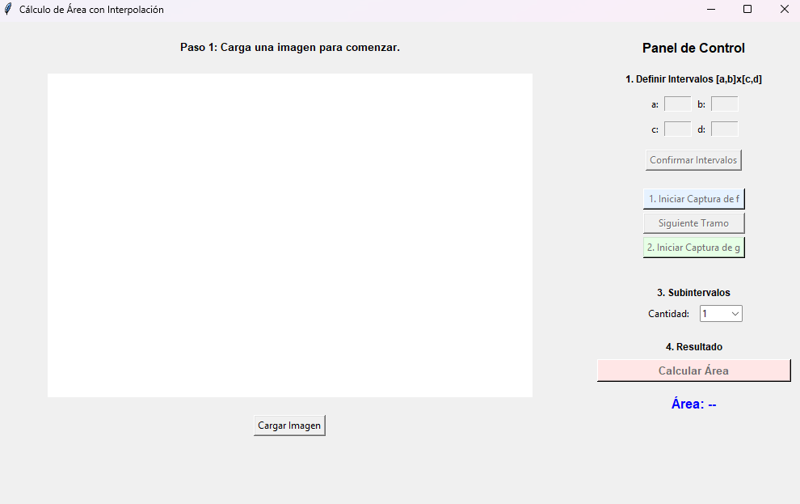

2. A continuación, presiona el botón "Cargar Imagen" para abrir el explorador de archivos y seleccionar tu imagen de referencia. Una vez cargada, debes delimitar el área de trabajo del lienzo (este paso es fundamental para la correcta escala de los cálculos). Para ello, haz un clic sobre la gráfica en la esquina inferior izquierda y luego otro en la esquina superior derecha. Se vería tal que así:

  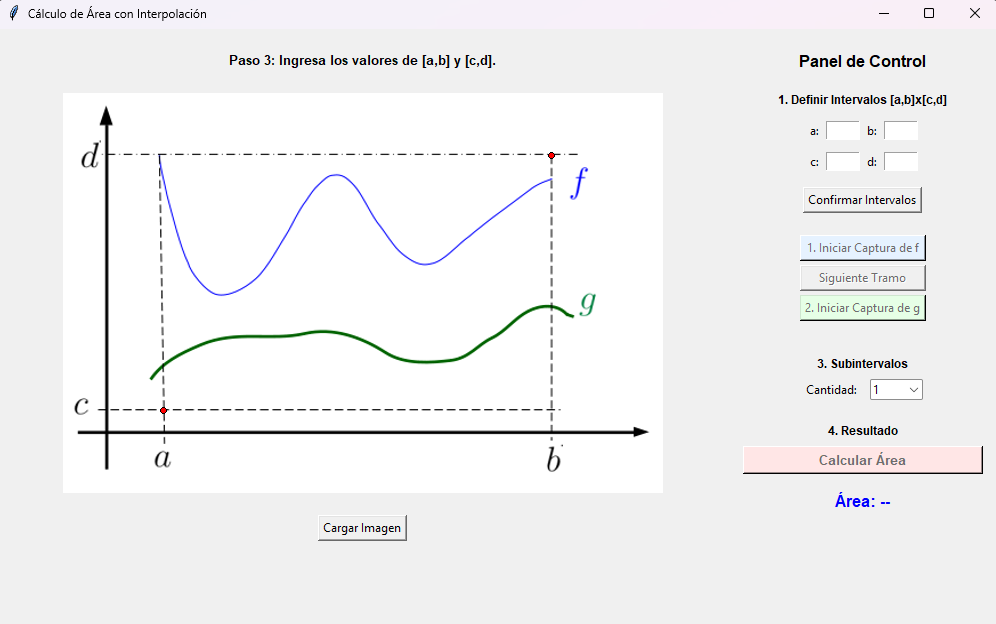

3. Luego, ingresa los valores numéricos de los intervalos $[a,b]$ y $[c,d]$ en los campos de la sección "1. Definir intervalos $[a,b] \times [c,d]$" del Panel de Control. Una vez asignados los valores, presiona el botón "Confirmar Intervalos" para continuar. Ejemplo:

  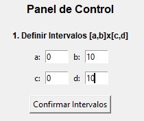

4. El siguiente paso es vital para definir correctamente el comportamiento de los polinomios. Fija primero la cantidad de subintervalos en los que deseas dividir el dominio para la curva $f$.

  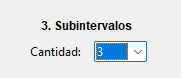

5. Presiona el botón "Iniciar Captura de f". Ahora, deberás hacer clic sobre la curva $f$ para marcar los extremos que delimitan cada subintervalo. El primer punto debe ser $(a,f(a))$ y el último $(b,f(b))$.Si elegiste 1 subintervalo, solo marcas esos 2 extremos.Si elegiste 2 subintervalos, marcas los extremos más un tercer punto intermedio.Si elegiste 3 subintervalos, marcas los extremos más dos puntos intermedios.Ejemplo de cómo se vería la captura para 3 subintervalos en $f$:

  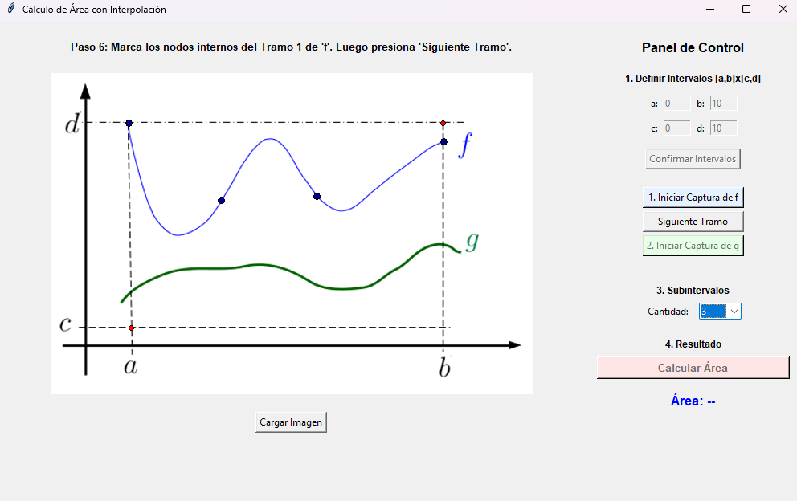

6. Tras fijar los límites, la interfaz te solicitará marcar los nodos internos tramo por tramo (de izquierda a derecha). Una vez marques todos los nodos del primer tramo, presiona el botón "Siguiente Tramo" para avanzar al segundo, y así sucesivamente hasta completarlos todos. (Nota: observarás que los nodos que delimitan cada subintervalo son más gruesos que los nodos internos para facilitar su identificación visual).

  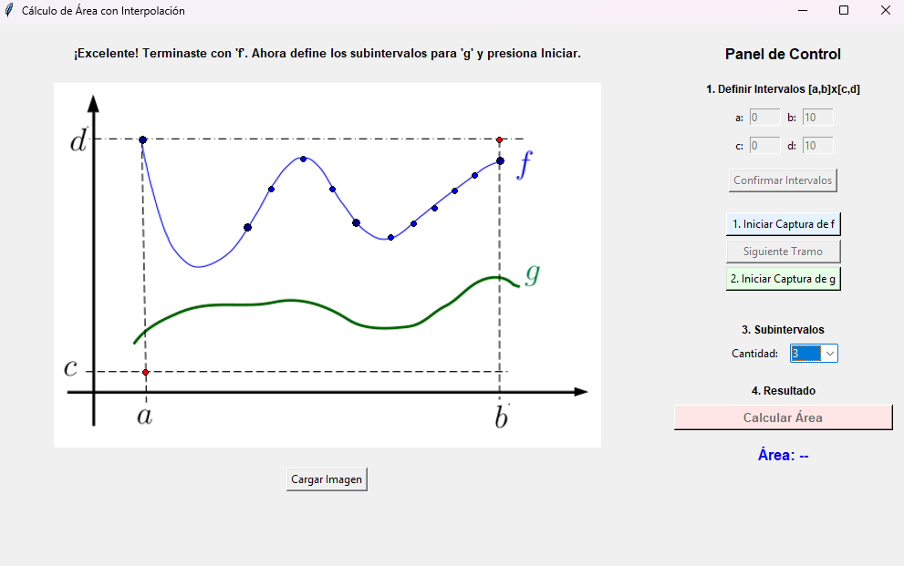

7. En este instante, el programa indicará que es el turno de la curva $g$. Puedes definir una cantidad de subintervalos distinta para esta curva si la geometría lo amerita. Luego, presiona "Iniciar Captura de g" y repite exactamente el mismo proceso de captura de límites y nodos internos realizado con $f$:

  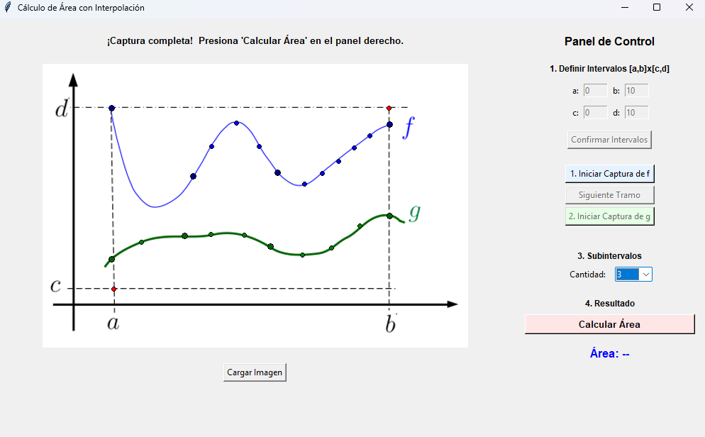

8. Finalmente, haz clic en el botón "Calcular Área". El programa procesará la información y mostrará en pantalla el resultado numérico del área comprendida entre $f$ y $g$, expresada en unidades cuadradas ($u^2$).

  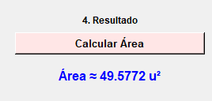

# Instrucciones de Uso: Módulo de Área entre dos curvas cerradas.

1. Ejecución del MóduloInicia el archivo interfazÁreaEntreCurvas.py. Este script despliega la interfaz gráfica y gestiona en segundo plano la comunicación con logicaÁreaEntreCurvas.py, el cual se encarga del procesamiento matemático (parametrización, generación de polinomios interpolantes y cálculo de integrales).Al iniciar, verás la ventana principal:

  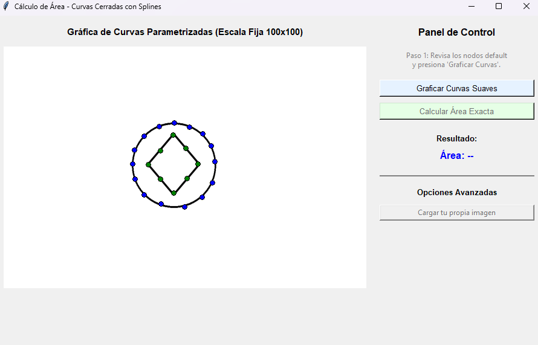

2. Prueba con el Ejemplo por DefectoLa interfaz carga inicialmente una imagen con dos figuras concéntricas y sus nodos ya marcados. Para probar el flujo:Haz clic en "Graficar Curvas Suaves" para que el lienzo genere las curvas interpoladas.Presiona "Calcular Área Exacta" para obtener el área comprendida entre ambas figuras en unidades cuadradas $(u^2)$.

  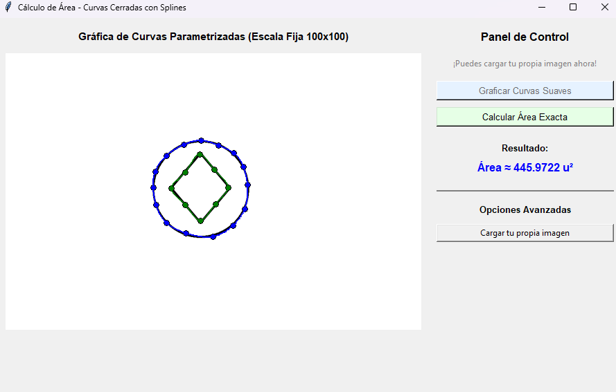

3. Carga de Imágenes PersonalizadasSi deseas trabajar con tus propios archivos, utiliza el botón "Cargar tu propia imagen". Esto te permitirá calcular el área concéntrica de cualquier par de figuras cerradas que desees analizar.

  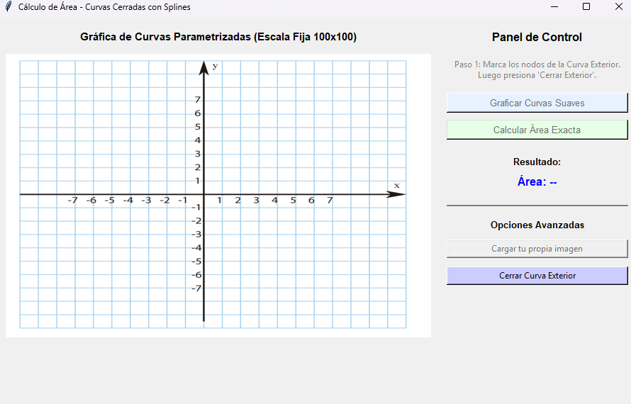

4. Definición de la Curva ExteriorUna vez cargada tu imagen, marca los puntos de la figura externa (se visualizarán como puntos azules). Al finalizar el trazado, haz clic en "Cerrar Curva Exterior" para definir el contorno.

  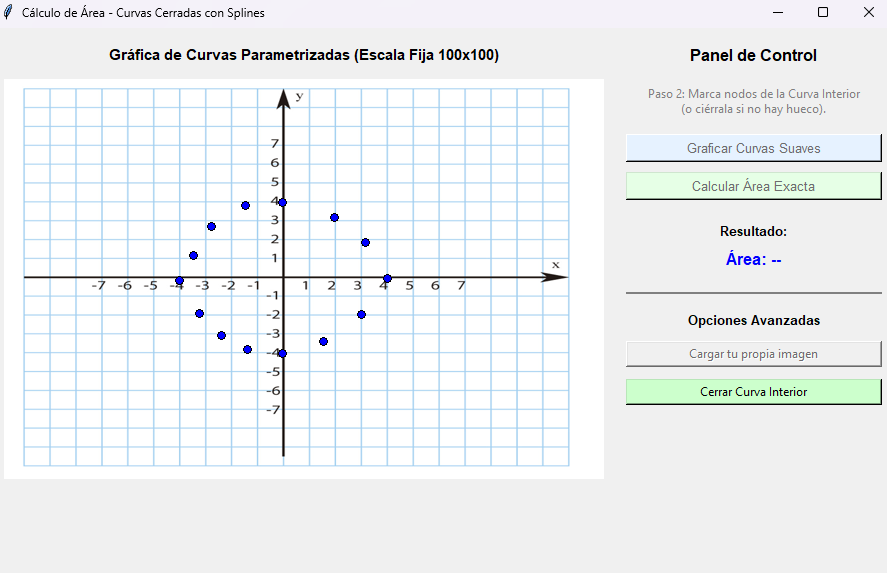

5. Definición de la Curva InteriorRepite el proceso anterior para la figura interna. Una vez marcados los nodos necesarios, presiona el botón "Cerrar Curva Interior".

  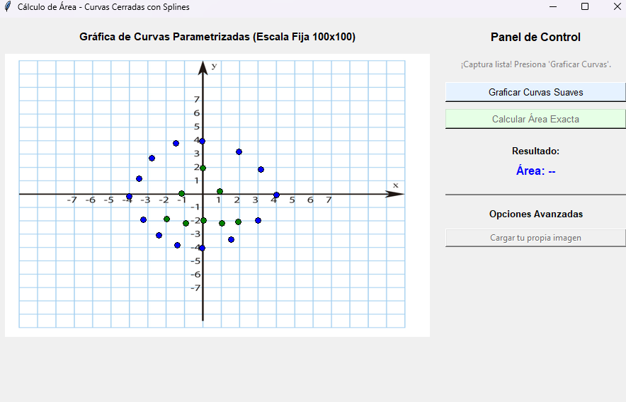

6. Procesamiento y ResultadosFinalmente, haz clic en "Graficar Curvas Suaves" para visualizar la suavización de ambos contornos. Luego, presiona "Calcular Área Exacta"; el sistema procesará la información y mostrará el área aproximada en $(u^2)$ contenida entre las dos curvas.

  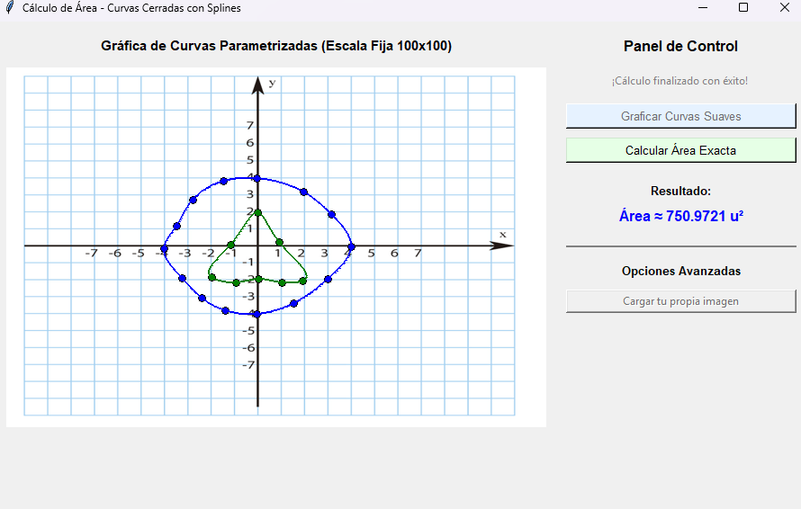

